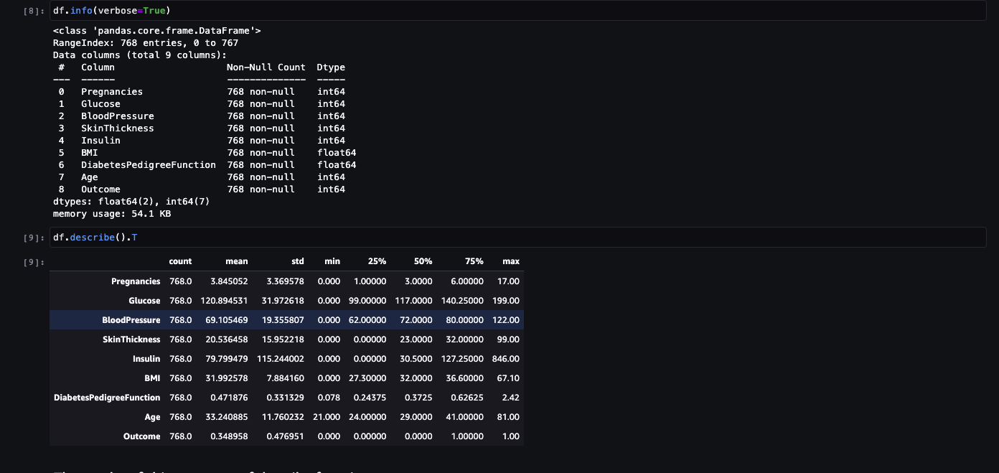
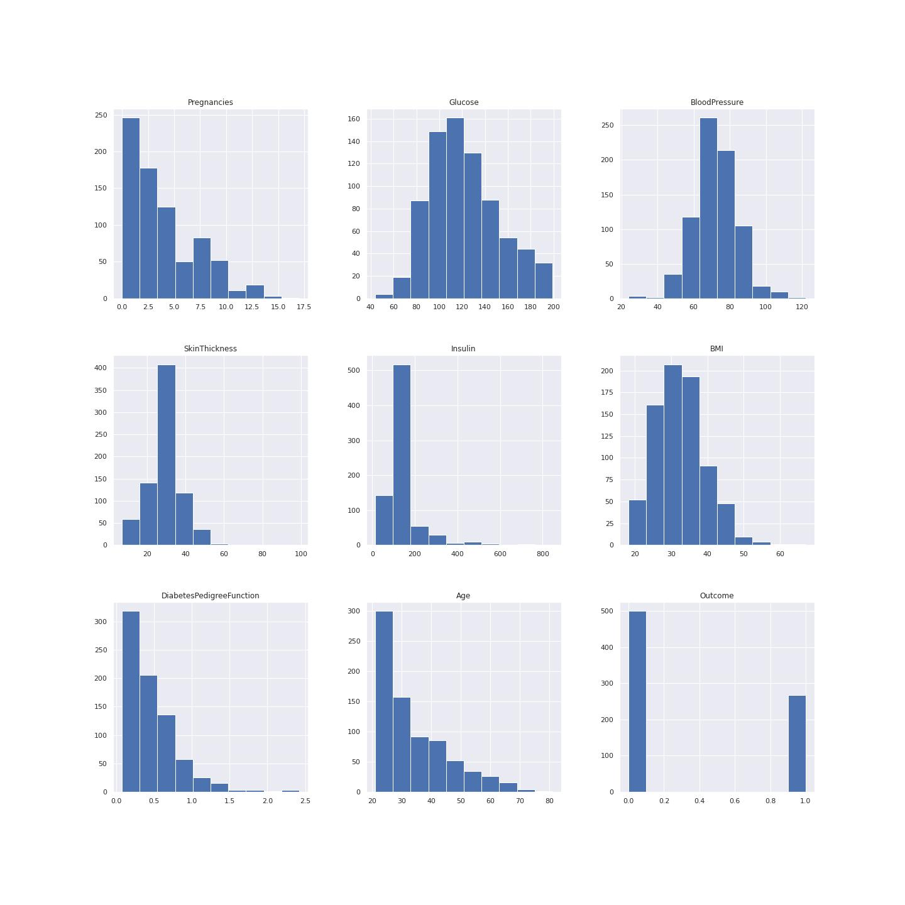
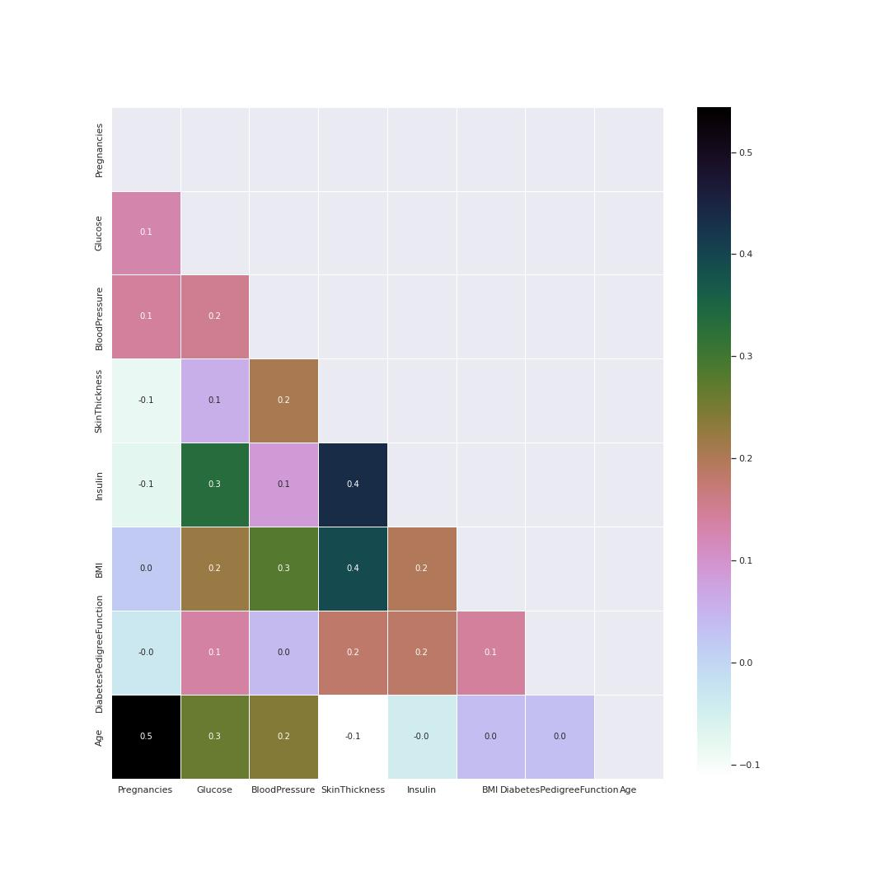
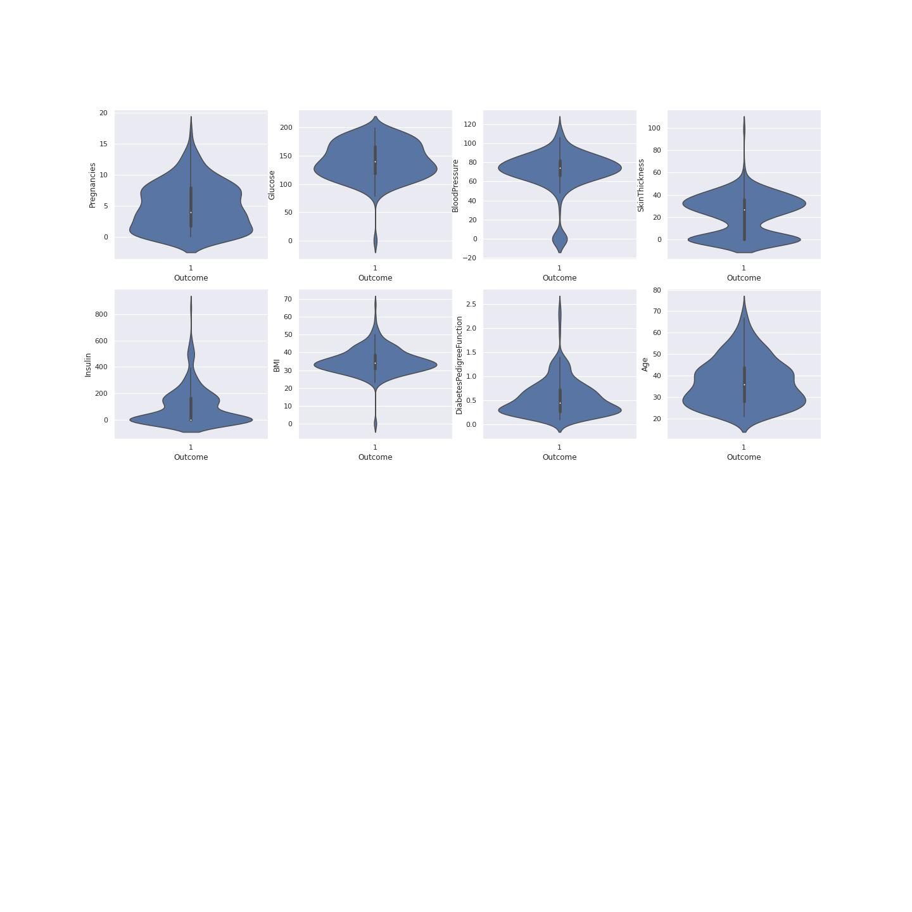
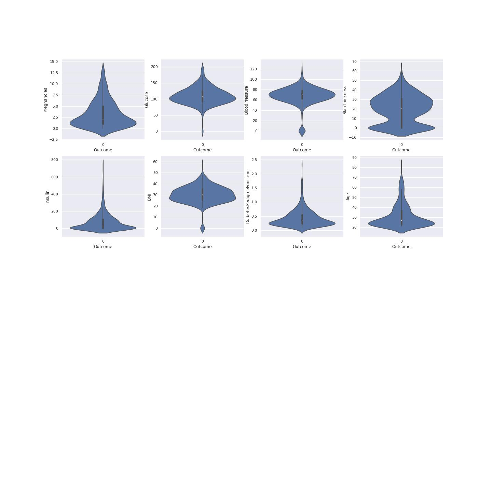
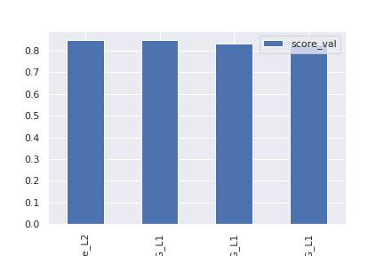

\newpage

```{r setup, include=FALSE}
knitr::opts_chunk$set(echo = TRUE)
```

# Definition

## Project Overview
Electronic Health records or Electronic Medical Records
data is the data being collected when we see a doctor, pick up a prescription at the pharmacy, or even from a visit to the dentist. 

This data is used for a variety of use-cases. From personalizing healthcare to discovering novel drugs and treatments to helping providers diagnose patients better and reduce medical errors.

Diabetes mellitus, or simply diabetes, is a leading non-communicable disease (NCD) globally, almost doubling in cases since 1980. It is a chronic illness that develops either when the pancreas are not able to generate sufficient insulin or when the body does not utilize the insulin produced effectively. There is no cure for this disease. Diabetes is thought to result from a combination of genetic and environmental factors. Several risk factors that are attributed to diabetes include ethnicity, family history of diabetes, age, excess weight, unhealthy diet, physical inactivity, and smoking. In addition to this, the absence of early detection of diabetes has been known to contribute to the development of other chronic diseases such as kidney disease.

## Dataset

This dataset is originally from the National Institute of Diabetes and Digestive and Kidney Diseases. The objective of the dataset is to diagnostically predict whether or not a patient has diabetes, based on certain diagnostic measurements included in the dataset. Several constraints were placed on the selection of these instances from a larger database. In particular, all patients here are females at least 21 years old of Pima Indian heritage.

The datasets consists of several medical predictor variables and one target variable, Outcome. Predictor variables includes the number of pregnancies the patient has had, their BMI, insulin level, age, and so on[@ehr].

## Problem Statement

Diabetes mellitus, or simply diabetes, is a leading non-communicable disease (NCD) globally, almost doubling in cases since 1980. It is a chronic illness that develops either when the pancreas are not able to generate sufficient insulin or when the body does not utilize the insulin produced effectively

Can you build a machine learning model to accurately predict whether or not the patients in the dataset have diabetes or not? 

This problem is a classification problem. In this problem, a classifier is built that can be trained using the given dataset and can be used to predict diabetes class from a given input dataset.
The chosen to use AutoML algorithm which is Autogluon. AutoGluon automates machine learning tasks enabling you to easily achieve strong predictive performance in your applications. With just a few lines of code, you can train and deploy high-accuracy machine learning and deep learning models on image, text, time series, and tabular data [@auto].

## Metrics

### AUC

AUC is used for binary classification, multiclass classification, and ranking problems. AUC measures the proportion of correctly ordered objects and the capability of the model to distinguish between the classes.

The AUC has an important statistical property: the AUC of a classifier is equivalent to the probability that the classifier will rank a randomly chosen positive instance higher than a randomly chosen negative instance.[@volo]

AUC is the Area Under the ROC Curve. The best AUC = 1 for a model that ranks all the objects right (all objects with class 1 are assigned higher probabilities then objects of class 0). AUC for the ‘bad’ classifier which is working as random guessing is equal to 0.5.[@volo]

The ROC curve shows the model’s ability to distinguishing between classes.

The model which randomly assigns a class to object is a ‘bad’ classifier and has a diagonal ROC curve. The better is the classifier, the higher is the ROC curve. The ROC curve is plotted with TPR, True Positive Rate, on the y-axis against the FPR, False Positive Rate, on the x-axis. The curve also could be interpreted in terms of Sensitivity and Specificity of the model with Sensitivity on the y-axis and (1-Specificity) on the x-axis.

Building and visualizing the ROC curve could be used to measure classification algorithm performance with different probability boundaries and select the probability boundary required to achieve the specified false-positive or false-negative rate.[@volo]


# Analysis

Data was stored in AWS S3 cloud service for training and evaluation of the model. The data is in csv format. This dataset is originally from the National Institute of Diabetes and Digestive and Kidney Diseases.
The datasets consists of several medical predictor variables and one target variable, Outcome. Predictor variables includes the number of pregnancies the patient has had, their BMI, insulin level, age, and so on[@ehr].

\begin{lstlisting}[language=python]
train_file = "train.csv"
train.to_csv(train_file, index=False)
train_s3_path = session.upload_data(train_file, key_prefix="{}/data".format(prefix))

test_file = "test.csv"
test.to_csv(test_file, index=False)
test_s3_path = session.upload_data(test_file, key_prefix="{}/data".format(prefix))


X_test_file = "X_test.csv"
X_test.to_csv(X_test_file, index=False)
X_test_s3_path = session.upload_data(X_test_file, key_prefix="{}/data".format(prefix))
\end{lstlisting}

## Data Exploration

**DataFrame.describe()** method generates descriptive statistics that summarize the central tendency, dispersion and shape of a dataset’s distribution, excluding NaN values. This method tells us a lot of things about a dataset. One important thing is that the describe() method deals only with numeric values. It doesn't work with any categorical values. So if there are any categorical values in a column the describe() method will ignore it and display summary for the other columns unless parameter include="all" is passed.

- count tells us the number of NoN-empty rows in a feature.
- mean tells us the mean value of that feature.
- std tells us the Standard Deviation Value of that feature.
- min tells us the minimum value of that feature.
- 25%, 50%, and 75% are the percentile/quartile of each features. This quartile information helps us to detect Outliers.
- max tells us the maximum value of that feature.

The figure 1 below shows the summary of the describe function and also the information about the dataset




**The results of this summary of describe function.**
There are some value of below listed columns have zero minimum, the value of zero does indicates missing value.
Following columns or variables have an invalid zero value:

 - Glucose
 - BloodPressure
 - SkinThickness
 - Insulin
 - BMI
 
 
## Exploratory Visualization

### Data Distribution

A left-skewed distribution has a long left tail. Left-skewed distributions are also called negatively-skewed distributions. That’s because there is a long tail in the negative direction on the number line. The mean is also to the left of the peak.

Figure 2 below shows data distribution.



Aright-skewed distribution has a long right tail. Right-skewed distributions are also called positive-skew distributions. That’s because there is a long tail in the positive direction on the number line. The mean is also to the right of the peak.

This data is  mostly left skewed for example the pregrancy plot, insulin, age and diabetes pedigree function.

### Correlation visualisation

Heatmap is good method to visualize correlation between features.
This heatmap helps to know the following pairs had a positive correlation coeffiecient between them as compared to other parameters.

 - Pregnancies and age
 - Insulin and Skin thickness
 - BMI and Skin thickness
 - Insulin and Glucose
 
 Glucose and BMI values are related the most. This indicates the two parameters need special attention.

The heatmap figure 3 shows correlation coeficient



### True Diabetes Distribution

A violin plot is a hybrid of a box plot and a kernel density plot, which shows peaks in the data. It is used to visualize the distribution of numerical data. Unlike a box plot that can only show summary statistics, violin plots depict summary statistics and the density of each variable.[@joel]

To understand data we have to plot data using violin visualization. This plotting shows where the outcome of diabetes was 1. This shows the distribution of the diabetes resulting from different factors. This gives us clear picture that Glucose, BMI and Insulin had the most effect on the outcome value. This also determines on the data division for model training and model testing. The median age is 35 of those having diabetes according the violin plot with the higher probability. Figure 4 shows the violin plots where the outcome is 1



### False Diabetes Distribution

To understand data we have to plot data using violin visualization. This plotting shows where the outcome of diabetes was 0.
Figure 5 shows the violin plots where the outcome is 0




## Algorithms and Techniques

AutoGluon automates machine learning tasks enabling you to easily achieve strong predictive performance in your applications. With just a few lines of code, you can train and deploy high-accuracy machine learning and deep learning models on image, text, time series, and tabular data.

AutoGluon enables easy-to-use and easy-to-extend AutoML with a focus on automated stack ensembling, deep learning, and real-world applications spanning image, text, and tabular data. [@auto]

## Benchmark
The benchmark used was DecisionTreeClassifier algorithm

\begin{lstlisting}[language=python]
from sklearn.tree import DecisionTreeClassifier
from sklearn.model_selection import train_test_split
from sklearn import tree

X=df[df.columns[0:-1]]
Y=df[df.columns[-1]]


X_train,X_test,y_train,y_test = train_test_split(X,Y,stratify=Y,random_state=42)
clf = DecisionTreeClassifier(max_depth=4,random_state=0)
clf.fit(X_train,y_train)
print("Accuracy on training set: {:.3f}".format(clf.score(X_train,y_train)))
print("Accuracy on test set: {:.3f}".format(clf.score(X_test,y_test)))

Accuracy on training set: 0.818
Accuracy on test set: 0.766

\end{lstlisting}

### Why use a decision tree?
- The advantages of using a decision tree are that:

- They can be easy to interpret (depending on the size of your data and the depth of your tree)
- They can handle both numeric and categorical data through scikit-learn
- They can limit the influence of poor predictors in your model


# Methodology 

## Data Preprocessing

Data was diveded into training set and testing set. The training set was 70 percent of the whole data while the testing set was 30 percent of the data.

\begin{lstlisting}[language=python]
train = df.sample(frac=0.7, random_state=42)
test = df.drop(train.index)

label = "Outcome"
y_test = test[label]
X_test = test.drop(columns=[label])

\end{lstlisting}

## Implementation

The platfrom for implimentation was AWS sagemaker studio. The data was stored in AWS S3 after it was devided for training set and testing set. The procedure for that was to create an S3 bucket using a script.


\begin{lstlisting}[language=python]

import os
import sys
import boto3
import sagemaker
from time import sleep
from collections import Counter
import numpy as np
import pandas as pd
from autogluon.tabular import TabularPredictor  
from sagemaker import get_execution_role, local, Model, utils, s3
from sagemaker.estimator import Estimator
from sagemaker.predictor import Predictor
from sagemaker.serializers import CSVSerializer
from sagemaker.deserializers import StringDeserializer
from sklearn.metrics import accuracy_score, classification_report
from IPython.core.display import display, HTML
from IPython.core.interactiveshell import InteractiveShell
import matplotlib.pyplot as plt
import seaborn as sns
sns.set()
import warnings
warnings.filterwarnings('ignore')
import missingno as msno
%matplotlib inline
session = sagemaker.Session()
bucket = session.default_bucket()
prefix = "sagemaker/autogluon-tabular"
region = session.boto_region_name
role = get_execution_role()
client = session.boto_session.client("sts", region_name=region, endpoint_url=utils.sts_regional_endpoint(region))


\end{lstlisting}

### Training

The model was trained using AUTOML autogluon [@auto]
\begin{lstlisting}[language=python]
%%time

predictor = TabularPredictor(label='Outcome', eval_metric='roc_auc',
                             ).fit(train_data=train_s3_path,
                                  time_limit=600,
                                  presets=['best_quality',
                                  'optimize_for_deployment'],)
\end{lstlisting}

```
                    model  score_val  pred_time_val    fit_time  pred_time_val_marginal  fit_time_marginal  stack_level  can_infer  fit_order
0     WeightedEnsemble_L2   0.849699       0.947987  235.299451                0.000524           0.249235            2       True          4
1       LightGBMXT_BAG_L1   0.848956       0.128012   40.415414                0.128012          40.415414            1       True          1
2  NeuralNetFastAI_BAG_L1   0.831127       0.355836  100.760741                0.355836         100.760741            1       True          2
3   NeuralNetTorch_BAG_L1   0.830445       0.463615   93.874062                0.463615          93.874062            1       True          3

model	score_val	pred_time_val	fit_time	pred_time_val_marginal	fit_time_marginal	stack_level	can_infer	fit_order
0	WeightedEnsemble_L2	0.849699	0.947987	235.299451	0.000524	0.249235	2	True	4
1	LightGBMXT_BAG_L1	0.848956	0.128012	40.415414	0.128012	40.415414	1	True	1
2	NeuralNetFastAI_BAG_L1	0.831127	0.355836	100.760741	0.355836	100.760741	1	True	2
3	NeuralNetTorch_BAG_L1	0.830445	0.463615	93.874062	0.463615	93.874062	1	True	3

```


## Refinement 

The refinement was to tune the hyperparameters and predict using one model and it was done two times. The aim was to observe the performance of prediction.

### Fine-tuning hyperparamters
The finetuning of the parameters set to 'very_light' as the code snipet shows below.
\begin{lstlisting}[language=python]
%%time

predictor = TabularPredictor(label='Outcome', 
                             eval_metric='roc_auc',
                             ).fit(train_data=train_s3_path,
                                  time_limit=600,
                                  presets=['best_quality', 'optimize_for_deployment'],
                                  hyperparameters='very_light',
                                  )
\end{lstlisting}

There was not much improvement after hyperparameter tuning as the snipet shows the model performance.
```
                     model  score_val  pred_time_val    fit_time  pred_time_val_marginal  fit_time_marginal  stack_level  can_infer  fit_order
0     WeightedEnsemble_L2   0.849699       0.947987  235.299451                0.000524           0.249235            2       True          4
1       LightGBMXT_BAG_L1   0.848956       0.128012   40.415414                0.128012          40.415414            1       True          1
2  NeuralNetFastAI_BAG_L1   0.831127       0.355836  100.760741                0.355836         100.760741            1       True          2
3   NeuralNetTorch_BAG_L1   0.830445       0.463615   93.874062                0.463615          93.874062            1       True          3

model	score_val	pred_time_val	fit_time	pred_time_val_marginal	fit_time_marginal	stack_level	can_infer	fit_order
0	WeightedEnsemble_L2	0.849699	0.947987	235.299451	0.000524	0.249235	2	True	4
1	LightGBMXT_BAG_L1	0.848956	0.128012	40.415414	0.128012	40.415414	1	True	1
2	NeuralNetFastAI_BAG_L1	0.831127	0.355836	100.760741	0.355836	100.760741	1	True	2
3	NeuralNetTorch_BAG_L1	0.830445	0.463615	93.874062	0.463615	93.874062	1	True	3
```


# Results

The results of Autogluon training can be seen in the summary below.
```

predictor.fit_summary(show_plot=True)

*** Summary of fit() ***
Estimated performance of each model:
model  score_val  pred_time_val    fit_time  pred_time_val_marginal  fit_time_marginal  stack_level  can_infer  fit_order
0     WeightedEnsemble_L2   0.849699       0.910417  242.822065                0.000679           0.457114            2       True          4
1       LightGBMXT_BAG_L1   0.848956       0.067625   41.802209                0.067625          41.802209            1       True          1
2  NeuralNetFastAI_BAG_L1   0.831127       0.364630  104.587116                0.364630         104.587116            1       True          2
3   NeuralNetTorch_BAG_L1   0.830445       0.477483   95.975625                0.477483          95.975625            1       True          3
Number of models trained: 4
Types of models trained:
{'StackerEnsembleModel_TabularNeuralNetTorch', 'WeightedEnsembleModel', 'StackerEnsembleModel_NNFastAiTabular', 'StackerEnsembleModel_LGB'}
Bagging used: True  (with 5 folds)
Multi-layer stack-ensembling used: False 
Feature Metadata (Processed):
(raw dtype, special dtypes):
('float', []) : 2 | ['BMI', 'DiabetesPedigreeFunction']
('int', [])   : 6 | ['Pregnancies', 'Glucose', 'BloodPressure', 'SkinThickness', 'Insulin', ...]
Plot summary of models saved to file: AutogluonModels/ag-20230310_110459/SummaryOfModels.html
*** End of fit() summary ***

```


## Model Evaluation

The model was evaluated by using predctor.evaluate command which is a built in command from the autogluon model. The result of the execution is shown in the script below.

```
predictor.evaluate(test_s3_path)

Loaded data from: s3://sagemaker-us-east-1-495962688195/sagemaker/autogluon-tabular/data/test.csv | Columns = 9 / 9 | Rows = 230 -> 230
Evaluation: roc_auc on test data: 0.8274792522424343
Evaluations on test data:
{
    "roc_auc": 0.8274792522424343,
    "accuracy": 0.7478260869565218,
    "balanced_accuracy": 0.6872327940313522,
    "mcc": 0.41186364034362855,
    "f1": 0.5735294117647058,
    "precision": 0.6842105263157895,
    "recall": 0.4936708860759494
}
{'roc_auc': 0.8274792522424343,
 'accuracy': 0.7478260869565218,
 'balanced_accuracy': 0.6872327940313522,
 'mcc': 0.41186364034362855,
 'f1': 0.5735294117647058,
 'precision': 0.6842105263157895,
 'recall': 0.4936708860759494}
```

- The roc-auc is 82 percent there is diabetes.In machine learning, we use ROC Curves to analyze the predictive power of a classifier: they provide a visual way to observe how changes in our model’s classification thresholds affect our model’s performance.

- Accuracy 75 percent shows that there is diabetes
- Balanced Accuracy 69 percent there is diabetes
- F1 score is 0.57 showing the good performance of the model. The F1-score is a great way to compare the performance of multiple classifiers

# Conclusion

AutoML frameworks offer an enticing alternative. For the novice, they remove many of the barriers of deploying high performance ML models. For the expert, they offer the potential of implementing best ML practices only once (including strategies for model selection, ensembling, hyperparameter tuning, feature engineering, data preprocessing, data splitting, etc.), and then being able to repeatedly deploy them. This allows experts to scale their knowledge to many problems without the need for frequent manual intervention.

## Reflection

The entire end-to-end problem solution can be summarized as the following :

1.  A challenge problem and an available public dataset were found.
2.  A suitable metric was found and implemented.
3.  The data was downloaded and split into training, testing sets.
4.  The data was prepared and preprocessed to be used as input for the classification model.
5.  The solution model classifier was tested on unseen dataset.

The challenging aspect of the project was the selection ECR AWS services which was abandoned due to the lack of support


## Improvement

For the improvement of our solution model, my suggestions are the following :

1.  Allowing the model to  have visual explainable for interplatability, ofcourse there is shapley values but its only for ECR(built in docker containers AWS). I say this since I tried to use ECR services and failed.
2.  Another possible improvement is collecting a larger dataset of landmarks, training the model on a larger amount data, but yeah again it is challenging to EHR data.
\newpage

# References

